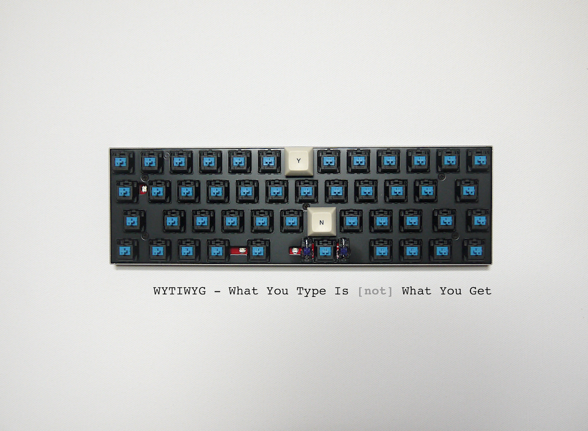
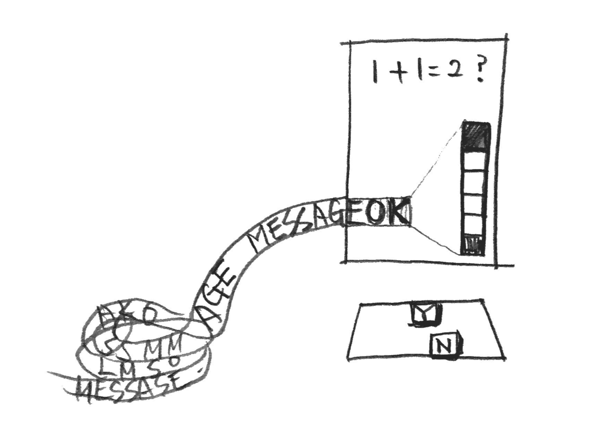

# WYTIWYG
WYTIWYG - What You Type Is [not] What You Get
 * SeungbumKim@PROTOROOM

## 작업설명
어떤 메시지를 전파하기 위해서는 메시지를 생산하는 과정에 많은 사람의 직/간접적인 참여가 필요하다.

그 과정에 관객의 적극적 기여를 유도하기 위해,
전달하려는 메시지의 각 비트는 Y / N 으로 답할 수 있는 질문으로 인코딩된다.
관객의 연산과 판단으로 해당 질문이 온전히 디코딩될 때 메시지는 세상에 드러나게 된다.

작가와 관객의 무지, 서로의 다른 취향, 혹은 다른 생각으로 인해 메시지는 온전히 표현될 수 있을까?
혹시라도 메시지를 온전히 되살렸다면, 당신은 그 사실을 마냥 기뻐할 수 있을까?

## license
 * [Artistic License 2.0](./LICENSE)
 * https://choosealicense.com/licenses/artistic-2.0/
