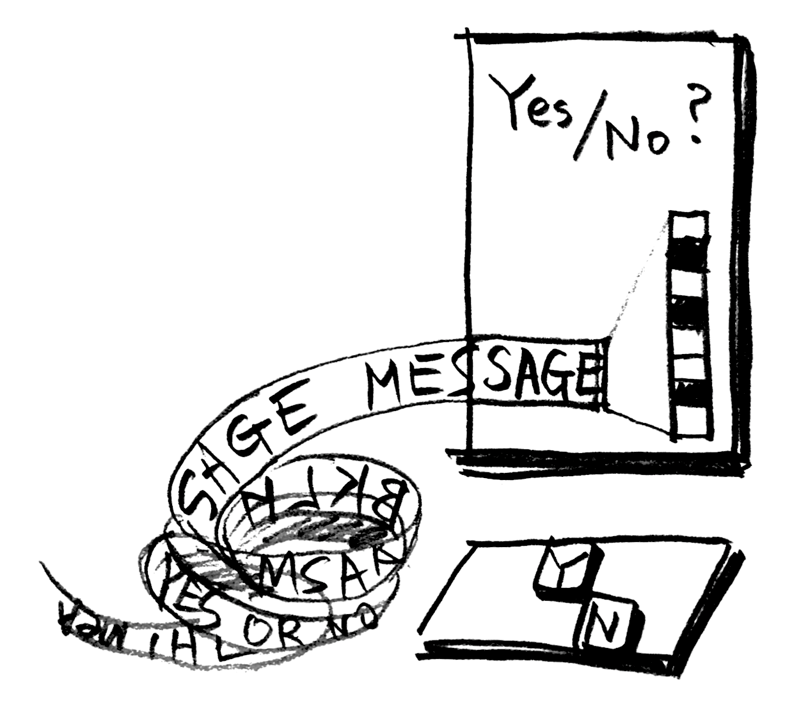

# WYTIWYG
WYTIWYG - What You Type Is [not] What You Get
 * 김승범@PROTOROOM ( SeungbumKim@PROTOROOM )

 * 변형된 키보드, 라즈베리파이, 열전사 프린터, 모니터
 * tweaked keyboard, raspberry pi, thermal printer, monitor

## 작업설명
어떤 메시지를 전파하기 위해서는 메시지를 생산하는 과정에 많은 사람이 직/간접적으로 참여해야 한다.

메시지를 생산하는 과정에 관객의 적극적 기여를 유도하기 위해,
전달하려는 메시지의 각 비트를 Y / N 으로 답할 수 있는 질문으로 인코딩하였다.

관객은 해당 질문에 대해 연산하고 판단하여 메시지의 비트를 디코딩하고,
층층이 쌓인 비트는 메시지를 담은 문장이 되어 세상에 드러나게 된다.

작가와 관객의 무지, 서로 상이한 취향과 생각으로 인해 메시지는 온전히 표현될 수 있을까?
혹시라도 메시지를 온전히 되살렸다면, 당신은 그 사실을 마냥 기뻐해도 될까?

당신이 직접 연산하여 만들어낸 메시지에 동의하는가?

## license
 * [Artistic License 2.0](./LICENSE)
 * https://choosealicense.com/licenses/artistic-2.0/
